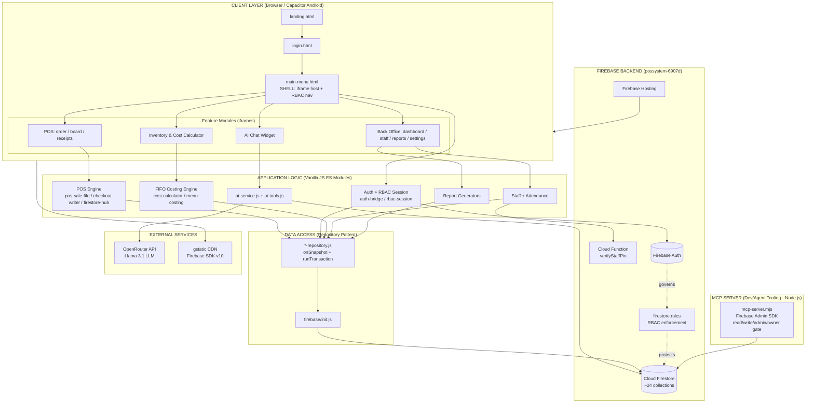

# KlikBurger / TAB KAUNTER — System Architecture

A restaurant **Point-of-Sale (POS) + Back-Office management system** for a burger stall, built as a **vanilla JavaScript (ES modules) web app** with **Firebase as the entire backend**. No frontend framework (no React/Vue) and **no Supabase**. The web app can also be packaged as an **Android app via Capacitor**.

---

## 1. High-Level Overview

The system is organized into **5 logical layers**, plus a side MCP server used only for development/AI-agent tooling.

```
[ Client Layer ] -> [ App/Logic Layer ] -> [ Data Access ] -> [ Firebase Backend ] -> [ External Services ]
                                                                      ^
                                          [ MCP Server (dev/agent tooling) ]
```

---

## 2. Architecture Layers

### Layer 1 — Client / Presentation (Browser or Android via Capacitor)
- **Entry**: `index.html` → `landing.html` → `login.html`
- **The Shell**: `main-menu.html` + `main-menu.js` — central hub. Loads every feature module inside **iframes**, persists the active module in `localStorage`, and enforces navigation permissions.
- **Feature pages (iframes)**:
  - POS group: `pos-order.html`, `pos-order-board.html`, `pos-receipts.html`
  - Back-office group: `dashboard.html`, `staff-dashboard.html`, `bo-monthly-reports.html`, `bo-settings*.html`, `menu-costing.html`, `pos-cost-calculator.html`
  - AI assistant widget (floating chat) embedded across pages

### Layer 2 — Application / Business Logic (Vanilla JS modules)
- **POS engine**: `pos-order-app.js`, `pos-sale-fifo.js`, `pos-checkout-firestore-writer.js`, `pos-firestore-hub.js`, `pos-tax.js`, `pos-shift-panel.js`
- **Auth / RBAC**: `pos-firebase-auth-bridge.js`, `pos-rbac-session.js`, `pos-rbac-constants.js`, `pos-page-auth.js`, `login.js`
- **Inventory / Costing (FIFO)**: `cost-calculator/*`, `menu-costing/*`
- **Staff**: `staff/staff-app.js`, `staff-repository.js`, `clock-attendance-firestore.js`
- **Reports**: `monthly-reports/*`
- **AI Assistant**: `ai-assistant/ai-service.js`, `ai-tools.js`, chat widgets

### Layer 3 — Data Access (Repository Pattern)
- `*-repository.js` files (ingredients, modifiers, recipes, batches, ledger, menu-items, sales, staff)
- Centralized Firebase init: `firebase/init.js`, `firebase/config.js`, `firebase/collections.js`
- Reads are mostly **real-time `onSnapshot` subscriptions**; critical writes use **`runTransaction`**

### Layer 4 — Firebase Backend (`possystem-6907d`)
- **Firebase Auth** — email/password login
- **Cloud Firestore** — single source of truth (~24 collections)
- **Cloud Functions** (region `asia-southeast1`) — exactly **one**: `verifyStaffPin` (server-side PIN check)
- **Firebase Hosting** — serves the web app
- **Security**: `firestore.rules` (role-based, keyed on `users/{uid}.role`)

### Layer 5 — External Services
- **OpenRouter API** (LLM: Llama 3.1 8B + fallbacks) — powers the AI assistant
- **gstatic.com CDN** — Firebase SDK v10.14.1

### Side Component — MCP Server (NOT part of runtime)
- `mcp-server.mjs` + `mcp/` — standalone **Node.js stdio server** using **Firebase Admin SDK** (bypasses security rules). Developer/AI-agent tool with permission gating (read/write/admin/owner).

---

## 3. Firestore Collections (Database)

| Collection | Purpose |
|---|---|
| `users` | Auth profile + RBAC `role` |
| `ingredients` | Raw ingredient catalog |
| `ingredient_batches` | **FIFO stock lots** |
| `ingredient_ledger` | Price/purchase/consumption history |
| `recipes` / `menu_items` / `modifiers` | Menu + bill-of-materials |
| `sales` / `pos_sales_transactions` | Sale records (immutable) |
| `pos_orders` (+ `items`) | Kitchen order lifecycle |
| `pos_receipts` | Receipts (append-only) |
| `pos_shifts` (+ `cash_movements`) | Cash drawer shifts |
| `pos_meta` | Counters (order#/receipt# sequences) |
| `pos_audit_logs` | Append-only audit trail |
| `staff` / `staff_activity` / `staff_settings` / `staff_pins` | Staff data + attendance |
| `monthly_reports` / `yearly_reports` | Aggregated reports |
| `knowledge_base` | AI knowledge source |

---

## 4. Key Data Flows

### Flow A — Login & RBAC
```
User -> login.html -> Firebase Auth (signInWithEmailAndPassword)
     -> auth-bridge reads users/{uid}.role
     -> rbac-session stores session in localStorage + BroadcastChannel (syncs across iframes)
     -> main-menu shell gates module access by role
```
Roles: `owner > admin > shift_lead > cashier`. Server enforcement = `firestore.rules`; client session = soft prototype layer.

### Flow B — POS Sale / Checkout (technical centerpiece)
```
Cashier adds items (pos-order-app)
   -> live stock check from ingredient_batches + recipe usage
   -> on payment: finalizePosSaleFifo() opens ONE Firestore transaction:
       1. read pos_meta/counters + batch docs
       2. FIFO deduction (oldest batch first) -> compute COGS + gross profit
       3. update ingredient_batches.qtyRemaining
       4. write sales/{id}
       5. write pos_orders + items, pos_receipts, pos_sales_transactions
   -> kitchen board updates in real-time via onSnapshot listener
```
Retries up to 8x on contention. Keeps counters + inventory + sale records **atomic**.

### Flow C — Staff Clock-In/Out
```
Staff enters PIN -> Cloud Function verifyStaffPin (server-side check vs staff_pins)
   -> rbac-session updates -> mirror to staff_activity (clock_in/clock_out) + pos_audit_logs
   -> reports & AI read staff_activity to compute hours worked
```

### Flow D — Inventory FIFO Costing
```
Purchase -> creates ingredient_batches lot (costPerUnit, openedAt) + ingredient_ledger entry
Sale -> consumes batches oldest-first
cost-calculator/core.js -> unit conversion + per-product cost
```

### Flow E — Monthly Report Generation
```
generate-monthly-report.js paginates over:
   pos_receipts, purchase_history, ingredient_ledger, pos_shifts, staff_activity
   -> computes gross sales, FIFO COGS, profit, payment split, drawer variance, payroll
   -> writes monthly_reports/{YYYY-MM}
yearly report rolls these up -> yearly_reports/{YYYY}
```

### Flow F — AI Assistant
```
User chat widget -> ai-service.askAI()
   -> loads knowledge_base from Firestore
   -> calls OpenRouter API (Llama 3.1) with tool definitions
   -> model requests a tool -> ai-tools.js queries Firestore directly
   -> results fed back to model -> final answer
```
13 tools (e.g. `getLowStock`, `getSalesSummary`, `getStockAnalysis`), role-filtered (staff vs owner).

---

## 5. Architecture Diagram (Mermaid)



---

## 6. Important Architectural Notes

- **Atomicity**: POS checkout is a single Firestore transaction (FIFO + counters + sale + receipt + order all-or-nothing).
- **Real-time sync**: Kitchen board, receipts, and shifts use live `onSnapshot` listeners — no polling.
- **Cross-iframe state**: The shell uses `localStorage` + `BroadcastChannel` to sync session/RBAC across iframes.
- **Two-tier security**: Hard server rules (`firestore.rules`) + soft client session state machine.
- **Single source of truth**: Firestore — the FIFO `usageBaseQty` logic is shared identically across POS, AI tools, and reports.
- **One Cloud Function**: Only `verifyStaffPin` runs server-side; the rest of the logic is client-side against Firestore.
